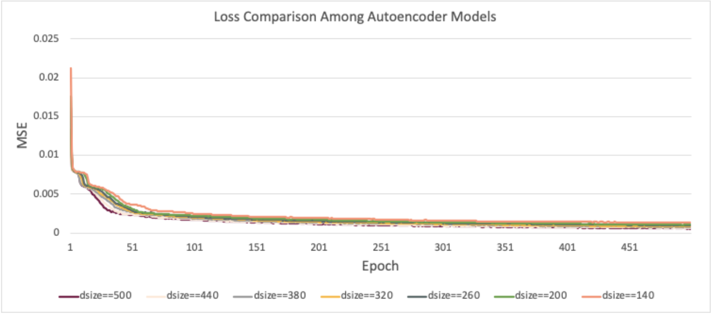
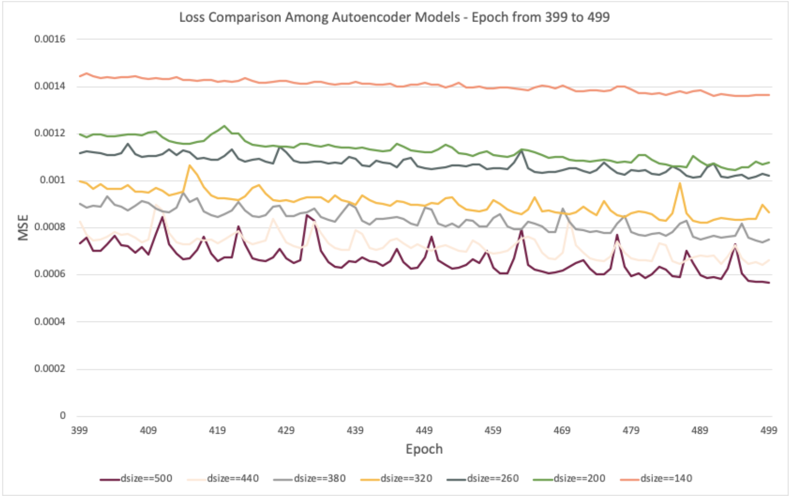
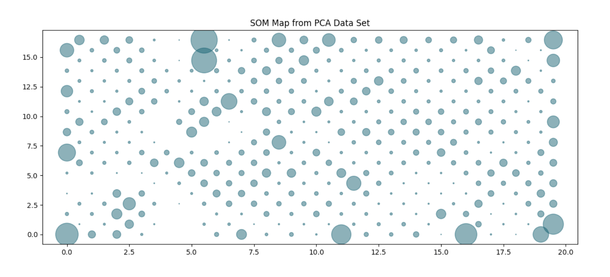
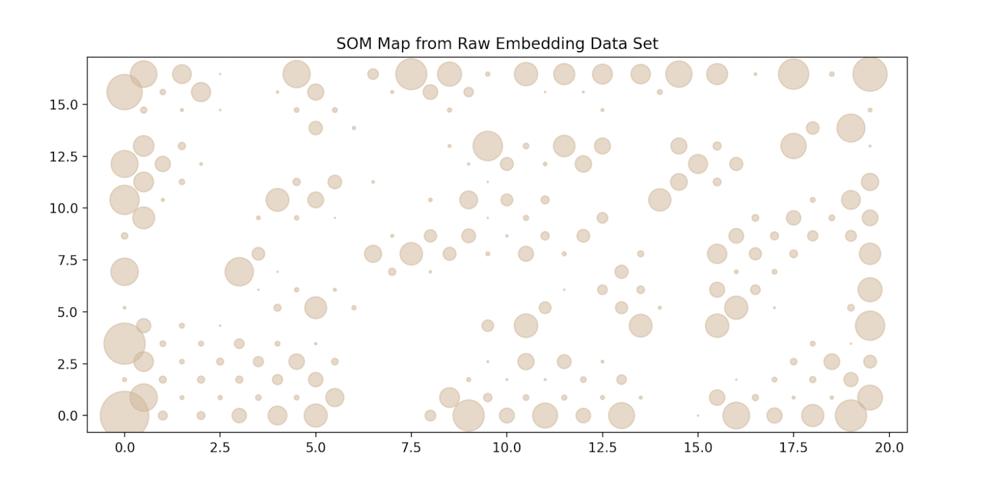

## User Profiling Based on Alexa Prize Tartan Socialbot Interaction with Human Users

---

Motivated by user profiling researches such as user actions towards emails (Karen Church et al., 2015), and users’ differentiated smartphone application usage(Sha Zhao et al., 2016), we believe that understanding the users is a fundamental step to create a better conversational AI with great user experience. With a large scale of voice interaction data collected through Alexa Prize, we are able to detect users’ varied responses towards the bot’s fixed prompts, then identify different user groups. In this research, an unsupervised clustering process towards social bot users is conducted in the intention of understanding users and further improving the bot design process.

### Sentence Embedding

---

Based on the raw data, embed each user utterances based on an inverse frequency-weighted embedding, each sentence is embedded to a 100-dimensional vector.

The smooth inverse frequency (SIF) weighted embedding method was used for sentence embedding procedure, which achieves significantly better performance than the unweighted average on a variety of textual similarity tasks(Sanjeev Arora et al., 2017).

During the process, a word-to-vector model was firstly trained using gensim word2vec package with CBOW method based on all user utterances from conversations during april 2020. The word2vec model provided the occurrence probability and 100-dimensional embeddings of words. Then, a SIF process was implemented to weight each vector with its probability.

### Embedding Challenges

---

However, the embedded data faced 3 major challenges. First off, it was directly calculated from raw text data without any language processing/cleansing module, which resulted in a certain amount of noise. Secondly, each prompts’ category was treated equally and transformed into a 100-dimensional vector. However, the richness of information towards different prompts may vary. Therefore, treating each category equally may not be the best way in order to grasp the more important information. Thirdly, a considerable amount of NA’s existed in the embedded dataset, as not every conversation involved all 4 categories of prompts.  
To tackle the first and second challenges, 3 different methods were used, they are:

1. traditional machine learning approach - principal component analysis;
2. simple neural network approach - autoencoder neural network model;
3. and artificial neural network approach - self-organizing map.
   To tackle the third challenge, the mean vectors were calculated separately in each bot prompt category, then filled into the NAs.

### Principal Component Analysis

---

Firstly, a principal component analysis process was implemented for compressing and denoising the data.

During the PCA process, for each grouped bot prompt parameter, principal components that explain at least 80% of the variance of the original data are kept.

| Parameter  | Principle Component Kept |
| ---------- | ------------------------ |
| Emotion    | 11                       |
| Next-topic | 15                       |
| Greeting   | 15                       |
| Plan       | 14                       |

For the [Emotion] parameter, 11 principal components are retained to capture at least 0.8 of the total variance; for the [Next-topic] parameter, 15 principal components are retained; for the [Greeting] parameter, 15 principal components are retained; for the [Plan] parameter, 16 principal components are retained. As a result, the original 400-dimensional embedding vector shrinks to a 57-dimensional vector.

Altogether, 66 parameters (57 from embedding & pca, 9 from conversation-level metadata) are considered in the next step of k-means clustering. As Euclidean distance is used in k-means procedural, a minmaxscaler is applied to all parameters that translates each feature between 0 and 1.

### Autoencoder

---

Apart from the traditional machine learning PCA method to cancel the noise, a simple bottleneck neural network architecture - autoencoder is also constructed to let the neural network learn what should be retained from the raw embedding data.  
The autoencoder has a bottleneck structure that can be trained to compress the data. It is a good way to denoise the data. A 6 layer fully connected neural network is implemented to train the autoencoder.

Setting the first layer neuron size as D, input as the raw embedding and meta data points (409 dimension), a 3-layer encoder is first constructed with relu as activation function, and sigmoid as output layer function. The neuron count is decreased to half the amount in the next layer. Secondly, using the encoder result as the input, a 3-layer decoder is constructed with relu as activation function, and sigmoid as output layer function. The neuron count is doubled in the next layer, till the output dimension is 409. The training procedure used Adam as optimizer, and mse as loss function, 2048 as the batch size and 500 epoch of training.

7 autoencoder models are trained, with first layer neuron size as 140, 200, 260, 320, 380, 440, and 500 representing different levels of compression/denoise of the original data. Here is the loss comparison among different models

  

### Self-organizing Map

---

Self-organizing map (SOM) is an artificial neural network algorithm that achieves dimensional reduction in an unsupervised way. SOM reduced the original data to a 2-dimensional map, and displays the similarities among data.

Firstly, 20\*20 elements were generated and evenly distributed in the map, each of these elements was a vector that had the same dimension as the raw data points. Then, in the competition process, each data point would be compared to the elements in the map, and the element which was the closest (in euclidean distance) to the data point was found as the winner element. The winning elements determine the spatial location of a topological neighbourhood, thereby providing the basis for cooperation/adaptation among neighbouring elements, pushing all neighbours towards the data point from the training set.

  

